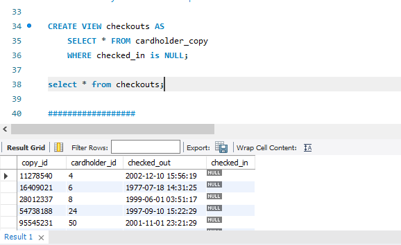
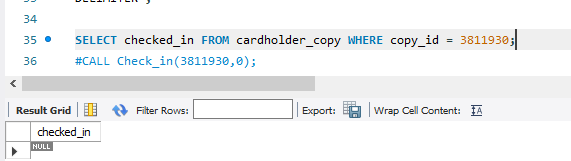
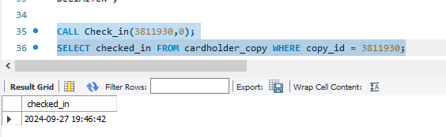

<div id="user-content-title">

<header>

# Chicago public library: database creation

</header>

- Kels Cavin, Peter Capuzzi, Andrew Chang-DeWitt
- Course project, second deliverable
- CS 425, Fall 2024
- Sept. 15, 2024

## Contents

- [Database & table creation](#user-content-database-creation)
- [Mock data loading](#user-content-data-loading)
- [Views, stored procedures, & functions](#user-content-views-stored-procedures-functions)
- [Temporary tables, triggers, & indexes](#user-content-temporary-tables-triggers-indexes)

</div>

## <span id="user-content-database-creation">Database & table creation</span>

We expanded our Relational Schema from the first deliverable to create a database named `chi_pub` created & the following tables in it.
The full source code for this is located in the attached source archive in the file `src/schema.sql`.

```sql
create database if not exists chi_pub;

use chi_pub;
```

### Author

```sql
create table if not exists author (
    aid int primary key,
    first_name varchar(510),
    last_name varchar(510) not null,
    about text
);
```

### Genre

```sql
create table if not exists genre (
    gid int primary key,
    name varchar(127)
);
```

### Subject

```sql
create table if not exists subject (
    sid int primary key,
    name varchar(255)
);
```

### Language

```sql
create table if not exists language (
    lid int primary key,
    name varchar(255)
);
```

### Book

```sql
create table if not exists book (
    bid int primary key,
    isbn char(13) not null,
    title varchar(255) not null,
    genre_id int,
    fiction bit(1), -- single bit bool repr, 0 is false, 1 is true
    edition varchar(127),
    pub_date date,
    foreign key (genre_id)
        references genre(gid)
        on delete set null
);
```

### Author to Book

```sql
create table if not exists author_book (
    author_id int not null,
    book_id int not null,
    primary key (author_id, book_id),
    foreign key (author_id)
        references author(aid)
        on delete cascade,
    foreign key (book_id)
        references book(bid)
        on delete cascade
);
```

### Subject to Book

```sql
create table if not exists subject_book (
    book_id int,
    subject_id int,
    primary key (subject_id, book_id),
    foreign key (book_id)
        references book(bid)
        on delete cascade,
    foreign key (subject_id)
        references subject(sid)
        on delete cascade
);
```

### Language to Book

```sql
create table if not exists language_book (
    book_id int,
    language_id int,
    primary key (language_id, book_id),
    foreign key (book_id)
        references book(bid)
        on delete cascade,
    foreign key (language_id)
        references language(lid)
        on delete cascade
);
```

### Cardholder

```sql
create table if not exists cardholder (
    chid int primary key,
    card_num int not null,
    first_name varchar(510),
    last_name varchar(510) not null,
    password varchar(127),
    addr_num smallint not null,
    addr_street varchar(255) not null,
    addr_apt varchar(31),
    addr_city varchar(127) not null,
    addr_state varchar(127) not null,
    addr_zip smallint not null,
    email varchar(255) not null
);
```

### Cardholder to phone number

```sql
create table if not exists cardholder_phone (
    cardholder_id int not null,
    phone_number char(10) not null,
    primary key (cardholder_id, phone_number),
    foreign key (cardholder_id)
        references cardholder(chid)
        on delete cascade
);
```

### Book to Cardholder

```sql
create table if not exists book_cardholder (
    timestamp timestamp not null,
    book_id int not null,
    cardholder_id int not null,
    status enum('pending', 'fulfilled', 'cancelled') not null,
    primary key (timestamp, book_id, cardholder_id),
    foreign key (book_id)
        references book(bid)
        on delete cascade,
    foreign key (cardholder_id)
        references cardholder(chid)
        on delete cascade
);
```

### Branch

```sql
create table if not exists branch (
    brid int primary key,
    name varchar(255) not null,
    addr_num smallint not null,
    addr_street varchar(255) not null,
    addr_apt varchar(31),
    addr_city varchar(127) not null,
    addr_state varchar(127) not null,
    addr_zip smallint not null
);
```

### Copy

```sql
create table if not exists copy (
    cid int primary key,
    book_id int not null,
    branch_id int not null,
    foreign key (book_id)
        references book(bid)
        on delete cascade,
    foreign key (branch_id)
        references branch(brid)
        on delete cascade
);
```

### Cardholder to Copy

```sql
create table if not exists cardholder_copy (
    copy_id int not null,
    cardholder_id int not null,
    checked_out timestamp not null,
    checked_in timestamp,
    primary key (copy_id, cardholder_id),
    foreign key (copy_id)
        references copy(cid)
        on delete cascade,
    foreign key (cardholder_id)
        references cardholder(chid)
        on delete cascade
);
```

## <span id="user-content-data-loading">Mock data loading</span>

Using the schema shown [above](#user-content-database-creation), we generated csv files of data for each table using the "Dummy Data for MYSQL Database" tool from Fill Database ([filldb.info](https://filldb.info)).
Generated data is available in `src/mock-data` in the attached source archive.

This data was then loaded into the database using the following bash script:

```bash
#!/usr/bin/env bash

db=chi_pub
glob=mock-data/*.csv

cd "$(dirname "$0")"

echo "Setting up database & tables..."
# start in sys database since a database has to
# be selected to execute a sql source
mysql -ppass sys < schema.sql
# verify database created
mysql -ppass -e "show databases;"
# verify tables created
mysql -ppass $db -e "show tables;"

# enable loading csv from file
mysql -ppass $db -e "set global local_infile=true;"
echo "Loading data from csv source..."
# loop over data files & load each one
for f in $glob; do
    b=${f##*/} # strip preceding path from file, giving basename (with extension)
    n=${b%.*}  # strip extension from file, giving basename only
    t=${n##*-} # strip numeric prefix, giving table name
    echo "loading data from $f into $t"
    # load data from csv
    l="load data local infile '$f' into table $t fields terminated by ',' ignore 1 lines;"
    mysql --local-infile=1 -ppass $db -e $l
    # select some records to verify data loaded
    mysql -ppass $db -e "select * from $t limit 15;"
done
```

The script gave the following output on run (with some truncations & edits to make viewing in this format easier), including verification of data loading via the `SELECT` statements executed via the mysql cli in the script above.

```
Setting up database & tables...

+--------------------+
| Database           |
+--------------------+
| chi_pub            |
| information_schema |
| mysql              |
| performance_schema |
| sys                |
+--------------------+

+-------------------+
| Tables_in_chi_pub |
+-------------------+
| author            |
| author_book       |
| book              |
| book_cardholder   |
| branch            |
| cardholder        |
| cardholder_copy   |
| cardholder_phone  |
| copy              |
| genre             |
| language          |
| language_book     |
| subject           |
| subject_book      |
+-------------------+

Loading data from csv source...

loading data from mock-data/01-author.csv into author

// table too wide to fit, see output file for full version

loading data from mock-data/02-genre.csv into genre


+-----+------------+
| gid | name       |
+-----+------------+
|   0 | excepturi  |
|   1 | in         |
|   3 | quaerat    |
|   6 | sunt       |
|   8 | id         |
|  29 | debitis    |
|  30 | occaecati  |
|  53 | quo        |
|  87 | architecto |
|  93 | qui        |
| 102 | molestias  |
| 198 | eum        |
| 228 | voluptas   |
| 483 | quo        |
| 741 | eveniet    |
+-----+------------+

loading data from mock-data/03-subject.csv into subject


+-----+--------------+
| sid | name         |
+-----+--------------+
|   0 | voluptas     |
|   1 | accusantium  |
|   2 | in           |
|   3 | eos          |
|   4 | sunt         |
|   8 | ut           |
|   9 | est          |
|  59 | at           |
|  61 | pariatur     |
|  62 | ducimus      |
|  74 | natus        |
|  83 | illum        |
| 125 | blanditiis   |
| 146 | perspiciatis |
| 183 | est          |
+-----+--------------+

loading data from mock-data/04-language.csv into language


+----------+-------------+
| lid      | name        |
+----------+-------------+
|        0 | in          |
|        6 | esse        |
|       35 | et          |
|       48 | saepe       |
|       75 | et          |
|      167 | qui         |
|      184 | et          |
|      366 | velit       |
|     3733 | sed         |
|   149674 | ipsam       |
|   487559 | aut         |
|  2260072 | consectetur |
|  2640555 | laborum     |
|  3872410 | dolor       |
| 29848962 | omnis       |
+----------+-------------+

loading data from mock-data/05-book.csv into book

// table too wide to fit, see output file for full version

loading data from mock-data/06-author_book.csv into author_book


+-----------+---------+
| author_id | book_id |
+-----------+---------+
|         0 |       0 |
|         1 |       1 |
|         2 |       2 |
|         3 |       3 |
|         4 |       4 |
|         5 |       5 |
|         7 |       6 |
|         8 |       7 |
|         9 |       8 |
|        28 |       9 |
|        32 |      11 |
|        40 |      12 |
|        41 |      13 |
|        49 |      14 |
|        67 |      15 |
+-----------+---------+

loading data from mock-data/07-subject_book.csv into subject_book


+---------+------------+
| book_id | subject_id |
+---------+------------+
|       0 |          0 |
|       1 |          1 |
|       2 |          2 |
|       3 |          3 |
|       4 |          4 |
|       5 |          8 |
|       6 |          9 |
|       7 |         59 |
|       8 |         61 |
|       9 |         62 |
|      11 |         74 |
|      12 |         83 |
|      13 |        125 |
|      14 |        146 |
|      15 |        183 |
+---------+------------+

loading data from mock-data/08-language_book.csv into language_book


+---------+-------------+
| book_id | language_id |
+---------+-------------+
|       0 |           0 |
|       1 |           6 |
|       2 |          35 |
|       3 |          48 |
|       4 |          75 |
|       5 |         167 |
|       6 |         184 |
|       7 |         366 |
|       8 |        3733 |
|       9 |      149674 |
|      11 |      487559 |
|      12 |     2260072 |
|      13 |     2640555 |
|      14 |     3872410 |
|      15 |    29848962 |
+---------+-------------+

loading data from mock-data/09-cardholder.csv into cardholder

// table too wide to fit, see output file for full version

loading data from mock-data/10-cardholder_phone.csv into cardholder_phone


+---------------+--------------+
| cardholder_id | phone_number |
+---------------+--------------+
|             0 | (769)507-6   |
|             0 | (952)879-0   |
|             2 | (806)781-7   |
|             2 | 488-853-96   |
|             4 | (842)371-6   |
|             4 | 643-730-28   |
|             5 | (717)353-8   |
|             5 | 296.369.23   |
|             6 | 114.581.61   |
|             6 | 210-125-40   |
|             7 | (177)109-4   |
|             7 | (839)056-4   |
|             8 | 421-473-56   |
|             8 | 533-116-99   |
|            11 | 1-469-262-   |
+---------------+--------------+

loading data from mock-data/11-book_cardholder.csv into book_cardholder


+---------------------+---------+---------------+-----------+
| timestamp           | book_id | cardholder_id | status    |
+---------------------+---------+---------------+-----------+
| 1970-02-19 09:00:58 |      38 |          4072 | pending   |
| 1970-03-06 20:09:28 |      20 |            50 | fulfilled |
| 1970-03-06 21:32:57 |       7 |            11 | cancelled |
| 1970-08-05 09:56:39 |      30 |           692 | cancelled |
| 1970-10-06 22:16:26 |      50 |         24718 | cancelled |
| 1971-11-23 06:11:12 |      23 |            56 | fulfilled |
| 1973-10-27 08:59:08 |      28 |           537 | pending   |
| 1973-12-25 06:48:38 |       5 |             7 | fulfilled |
| 1975-05-15 05:22:54 |       1 |             2 | fulfilled |
| 1976-09-19 04:19:37 |       9 |            15 | cancelled |
| 1977-06-17 23:42:31 |      13 |            25 | cancelled |
| 1979-12-29 10:51:08 |      32 |           992 | fulfilled |
| 1980-11-04 06:40:53 |       4 |             6 | fulfilled |
| 1984-02-07 20:31:44 |       8 |            12 | cancelled |
| 1984-06-21 04:44:53 |      44 |          8657 | fulfilled |
+---------------------+---------+---------------+-----------+

loading data from mock-data/12-branch.csv into branch

// table too wide to fit, see output file for full version

loading data from mock-data/13-copy.csv into copy


+----------+-----------+-----------+
| cid      | book_id   | branch_id |
+----------+-----------+-----------+
|  3811930 |       256 |        65 |
|  8874928 |    714417 |        11 |
| 11278540 |      5633 |        96 |
| 11758107 |  90071911 |   7253076 |
| 16409021 |         2 |        78 |
| 21227193 |  76460661 |        65 |
| 28012337 |  88021511 |     53172 |
| 28959398 |     18570 |        11 |
| 35683014 |     89495 |        11 |
| 41320555 |       343 |     28410 |
| 48676202 |     67165 |        11 |
| 54738188 | 930014220 |        78 |
| 67662260 |     10410 |     53172 |
| 70986019 |     70425 |   7253076 |
| 73256695 | 525914250 |     12617 |
+----------+-----------+-----------+

loading data from mock-data/14-cardholder_copy.csv into cardholder_copy

+----------+---------------+---------------------+---------------------+
| copy_id  | cardholder_id | checked_out         | checked_in          |
+----------+---------------+---------------------+---------------------+
|  3811930 |             0 | 2015-05-20 05:37:26 | 0000-00-00 00:00:00 |
|  8874928 |             2 | 2005-08-25 21:33:55 | 2009-12-27 05:51:45 |
| 11278540 |             4 | 2002-12-10 15:56:19 | 0000-00-00 00:00:00 |
| 11758107 |             5 | 2017-05-09 05:07:59 | 1985-01-27 12:44:21 |
| 16409021 |             6 | 1977-07-18 14:31:25 | 0000-00-00 00:00:00 |
| 21227193 |             7 | 1981-01-18 09:52:30 | 2005-09-13 08:33:49 |
| 28012337 |             8 | 1999-06-01 03:51:17 | 0000-00-00 00:00:00 |
| 28959398 |            11 | 1977-06-11 22:03:02 | 2013-05-13 04:12:53 |
| 35683014 |            12 | 1978-10-08 17:59:34 | 1999-09-08 04:31:41 |
| 41320555 |            15 | 2005-10-20 15:05:49 | 1976-11-17 13:33:41 |
| 48676202 |            20 | 1973-01-23 06:14:32 | 2003-07-10 04:37:20 |
| 54738188 |            24 | 1997-09-10 15:22:29 | 0000-00-00 00:00:00 |
| 67662260 |            25 | 2003-05-26 23:58:20 | 1990-04-18 09:46:06 |
| 70986019 |            27 | 1976-10-19 13:34:48 | 1971-02-28 07:46:20 |
| 73256695 |            28 | 1992-10-11 22:19:48 | 2017-01-25 22:39:29 |
+----------+---------------+---------------------+---------------------+
```

## <span id="user-content-views-stored-procedures-functions">Views, stored procedures, & functions</span>

Created a view to run a query on cardholder_copy that displays only copies which are checked out.



Created two stored procs. SelectBookByAuthorLastName polls a result set of any books in the catalog with the given varchar lastname.
Check_in updates cardholder_copy.checked_in with the current system timestamp.






Created one function to calculate due dates by adding two weeks to a given cardholder_copy.checked_out datetime value.


## <span id="user-content-temporary-tables-triggers-indexes">Temporary tables, triggers, & indexes</span>

Created 2 new Indexes on author.last_name and book.isbn. Assumes that these are going to be frequently accessed and having indexes here could have impact on the speed of queries.
No applicable output for this one, but the sql code follows.

```sql
#Speed up lookup by author last name
CREATE INDEX a_lname ON author(last_name);

#Speed up lookup by ISBN
CREATE INDEX isbn ON book(isbn);
```

Created a trigger on cardholder_copy.checked_in, where, if an automated data population client attempts to insert an invalid datetime value of '0000-00-00 00:00:00' it will catch it and change that value to null before populating the DB itself
No applicable output for this one, but the sql code follows.

```sql
DELIMITER //
CREATE TRIGGER verify_datetime
BEFORE INSERT ON chi_pub.cardholder_copy
FOR EACH ROW
IF new.checked_in < '0000-01-01 00:00:00' THEN SET new.checked_in = NULL;
END IF; //
```

Created a temporary table called copystatus, which runs a query to consolidate every single copy with its branch and current in/out status. This would: be better if it also calculated the hold status, and probably also be better as a view, but we need a temporary table for the assignment.


