# Chicago public library database design

- Kels Cavin, Peter Capuzzi, Andrew Chang-DeWitt
- CS 425, Fall 2024
- Sept. 13, 2024

## Entity Relationship Diagram

## Relational Schema

The main entities, including all necessary data for books & where they're stored:

1. Book(<ins>bid</ins>, isbn, title, genre_id, fiction, edition, pub_date)
1. Author(<ins>aid</ins>, first_name, last_name, about)
1. Genre(<ins>gid</ins>, name)
1. Subject(<ins>sid</ins>, name)
1. Language(<ins>lid</ins>, name)
1. Copy(<ins>cid</ins>, book_id, branch_id)
1. Cardholder(<ins>chid</ins>, card_num, first_name, last_name, password, addr_num, addr_street, addr_apt, addr_city, addr_state, addr_zip, phone, email)
1. Branch(<ins>brid</ins>, name, addr_num, addr_street, addr_apt, addr_city, addr_state, addr_zip)

The following bridge entities are used to handle checking borrowed books in/out or placing/modifying hold requests, as well as any other many-to-many relationships:

1. Cardholder_Copy(<ins>copy_id, cardholder_id</ins>, out, in, due_date)
1. Book_Cardholder(<ins>timestamp, book_id, cardholder_id</ins>, status)
1. Author_Book(<ins>book_id, author_id</ins>)
1. Subject_Book(<ins>book_id, subject_id</ins>)
1. Language_Book(<ins>book_id, language_id</ins>)

## Business Rules

1. An Author can write one or more Books;
   however, every Book is written by at least one Author.
2. One Genre can contain one or more Books;
   however, every Book belongs to exactly one Genre.
3. One or more Subjects may describe a Book.
   One or more Books may be described by a Subject.
4. One or more Languages can be used to write a Book;
   a Book must be written in at least one Language.
5. A Book may be requested for Hold by one or more Cardholder.
   A Cardholder may request a Hold for one or more Book.
6. A Book may have one or more Copy;
   however, every Copy has exactly one Book.
7. A Copy can have one or more Borrow records for one or more Cardholder.
   A Cardholder can have one or more Borrow records for one or more Copy.
8. A Copy must be located at exactly one Branch,
   however, a Branch may have one or more Copy.
