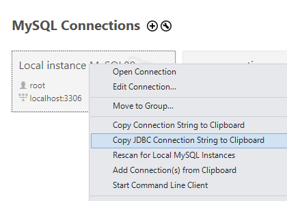

### Dev FAQ

#### Properties File
- Update the src/main/resources/default_properties.properties with your database information
- You can format your own JDBC url or get it from mySQL workbench here

  

- PropertiesManager.java handles the properties file; if you need to access it, initialize like so:
    - `PropertiesManager props = PropertiesManager.getInstance()`
    - That's it! You can then access properties with the getter methods.
    - `props.getDbJdbcUrl()`

#### Queries file
- Add your queries to the src/main/resources/queries.properties file, following the convention of the sql.create, sql.update, etc... prefixes
- If your query could be applied to multiple tables, use a placeholder value `$tname`
    - `sql.read.selectall = select * from $tname`
- Otherwise, make variable parameters generic with `?`. Note you cannot use `?` for table names & attributes.
    - `sql.read.selectstudentswithname = select * from students where name = ?`
- The QueriesManager.java handles retrieving those queries. Initialize a QueriesManager with getInstance():
  - `QueriesManager queries = QueriesManager.getInstance();`
- Then retrieve queries as strings using the CRUD enum and the names in the properties file.
  - `queries.get(DELETE, "deleteallstudentsbyage")`
  - `queries.get(READ, "selectall")`
  
Example:  

    - In the queries file: 
    sql.read.selectupperlevelstudents=select * from students where grade >= ?

    - In the code: 
     try(PreparedStatement ps = connection.PrepareStatement(queries.get(READ, "selectupperlevelstudents"))){
        ps.setInt(1, 7); //sets grade to >= 7
        ResultSet rs = ps.executeQuery();
     }catch(...)
     //Notice that the PreparedStatement is passed in the try with resources args!

    - In the queries file: 
    sql.read.selectall=select * from $tname

    - In the code: 
     try(PreparedStatement ps = connection.PrepareStatement(queries.get(READ, "selectall").replace("$tname", "boats"))){
        ResultSet rs = ps.executeQuery();
     }catch(...)

#### Other
- Group constant variables in Constants.java; always use descriptive, all caps names
- "Magic numbers" should be defined as constants (ex. `MINIMUM_AGE = 21`)
- If additional properties need to be introduced, update PropertiesManager.java to retrieve them in memory
- Liberally utilize the Logger instead of System.out.println calls
- Define a logger in every class like so:
  - `    private static final Logger LOGGER = LogManager.getLogger($CLASSNAMEHERE.class);`
- Right now logs do not append; the latest logs are always overwritten in `latest_log.log`
- If you need to access external files in the code, put them in src/main/resources and ALWAYS use THE CLASSLOADER like so
  - `$CLASSNAMEHERE.class.getResourceAsStream($FILENAMEHERE)` OR `$CLASSNAMEHERE.class.getResource($FILENAMEHERE)`
- DO NOT ACCESS RESOURCE FILES THIS WAY!!!!!!!
  - `File myFile = new File("path/to/file")`