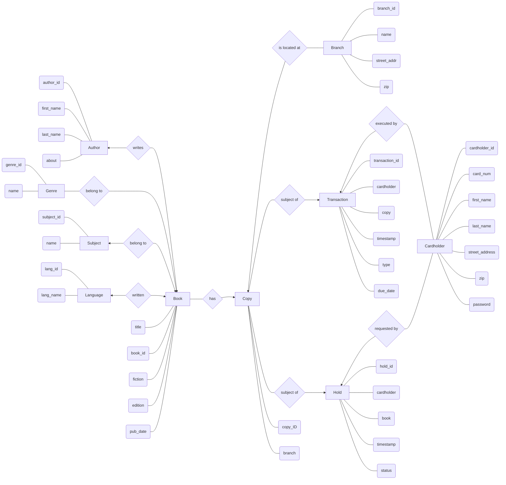

<div id="user-content-title">

# Chicago public library database design

- Kels Cavin, Peter Capuzzi, Andrew Chang-DeWitt
- CS 425, Fall 2024
- Sept. 13, 2024

</div>

## Entity Relationship Diagram

<!---->



## Relational Schema

The main entities, including all necessary data for books, where they're stored, & checking them in/out or placing holds is included in the following entities:

```
Book(BID, ISBN, title, genre_ID, fiction, edition, pub_date)
Author(AID, first_name, last_name, about)
Genre(GID, name)
Subject(SID, name)
Language(LID, name)
Transactions(TID, timestamp, type, inventory_ID, cardholder_ID, due_date)
Holds(HID, timestamp, book_ID, cardholder_ID, status)
Inventory(IID, book_ID, location_ID)
Cardholder(CID, card_num, first_name, last_name, password, street_addr, zip, phone, email)
Location(LoID, name, street_addr, zip)
```

The following bridge entities are used to handle most many:many relationships:

```
Book_to_Author(book_ID, author_ID)
Book_to_Subject(book_ID, subject_ID)
Book_to_Language(book_ID, language_ID)
```

## Business Rules

... insert rules here when done ...
