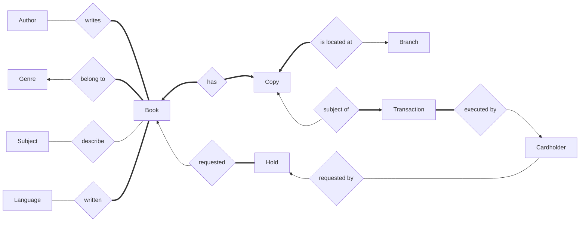

<div id="user-content-title">

# Chicago public library database design

- Kels Cavin, Peter Capuzzi, Andrew Chang-DeWitt
- CS 425, Fall 2024
- Sept. 13, 2024

</div>

## TODO:

- [ ] ERD
    - [x] get all E, R, & attrs into diagram
    - [ ] fix cardinality
    - [ ] include participation
    - [ ] fix arrowless link problem mermaid-js/mermaid/issues/5813
    - [ ] review for edits/corrections
- [ ] Relational Schema
    - [x] draft
    - [ ] review/make names match ERD
- [ ] Business Rules

## Entity Relationship Diagram

<!---->



Attributes to add still:

```
    aid(author_id) --- A
    af(first_name) --- A
    al(last_name) --- A
    aa(about) --- A

    gid(genre_id) --- G
    gnm(name) --- G

    sid(subject_id) --- S
    sn(name) --- S

    lid(lang_id) --- L
    lnm(lang_name) --- L

    bt(title) --- B
    bid(book_id) --- B
    bf(fiction) --- B
    be(edition) --- B
    bp(pub_date) --- B

    C --- cid(copy_ID)
    C --- cbr(branch_id)
    C --- cbk(book_id)

    H --- hid(hold_id)
    H --- hch(cardholder)
    H --- hbk(book)
    H --- hts(timestamp)
    H --- hst(status)

    Br --- brd(branch_id)
    Br --- bn(name)
    Br --- ba(street_addr)
    Br --- bz(zip)

    T --- tid(transaction_id)
    T --- tch(cardholder)
    T --- tcp(copy)
    T --- tts(timestamp)
    T --- ttp(type)
    T --- tdt(due_date)

    Ch --- chid(cardholder_id)
    Ch --- chnm(card_num)
    Ch --- chfn(first_name)
    Ch --- chln(last_name)
    Ch --- chsa(street_address)
    Ch --- chz(zip)
    Ch --- chpw(password)
```

## Relational Schema

The main entities, including all necessary data for books, where they're stored, & checking them in/out or placing holds is included in the following entities:

```
Book(BID, ISBN, title, genre_ID, fiction, edition, pub_date)
Author(AID, first_name, last_name, about)
Genre(GID, name)
Subject(SID, name)
Language(LID, name)
Transactions(TID, timestamp, type, inventory_ID, cardholder_ID, due_date)
Holds(HID, timestamp, book_ID, cardholder_ID, status)
Inventory(IID, book_ID, location_ID)
Cardholder(CID, card_num, first_name, last_name, password, street_addr, zip, phone, email)
Location(LoID, name, street_addr, zip)
```

The following bridge entities are used to handle most many:many relationships:

```
Book_to_Author(book_ID, author_ID)
Book_to_Subject(book_ID, subject_ID)
Book_to_Language(book_ID, language_ID)
```

## Business Rules

... insert rules here when done ...
