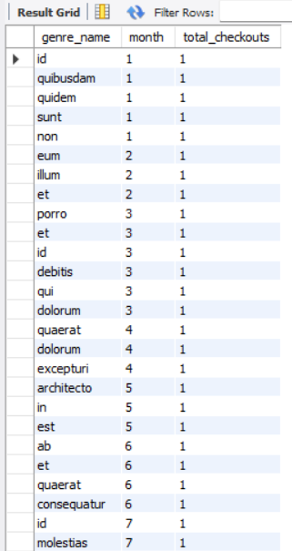
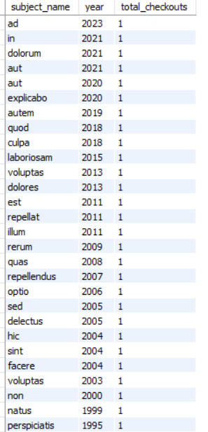
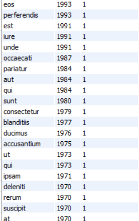
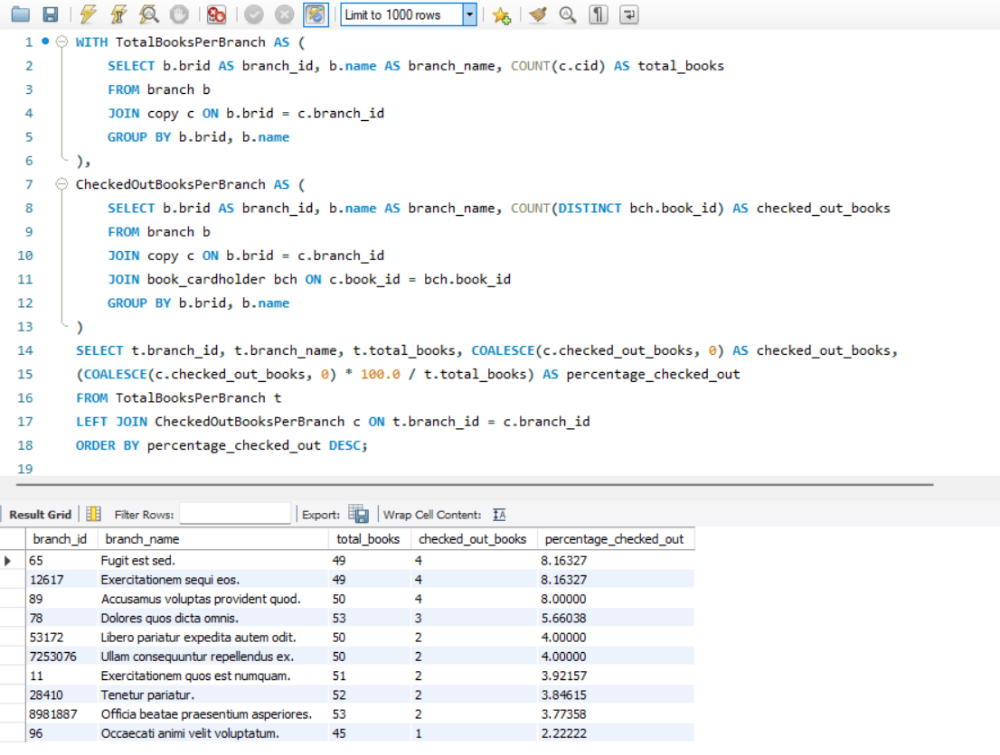

<header>

# Chicago public library: database queries

</header>

- Kels Cavin, Peter Capuzzi, Andrew Chang-DeWitt
- Course project, third deliverable
- CS 425, Fall 2024
- Oct. 11, 2024

## Query 1

Get count of books each author has written.

## Query 2

Get books ranked by genre.

## Query 3

Get books with their genre & subject.

## Query 4

Get checkout transactions by cardholder ID.

## Query 5

Get transactions in the last week.

## Query 6

Branch popularity ranking.

## Query 7

Most popular genre by time of year.

## Query 8

Number of genres checked out by cardholders.

## Query 9

Trending subjects by year.

## Query 10

Books checked out vs. total books, shows books as percentage & shows branch performance.

## Query 11

Get all overdue books for a given cardholder.

## Query 12

Get all cardholders with very overdue books.

## Query 13

Get all books in a particular language.

## Query 14

Get all pending holds requested by all cardholders with books overdue.

